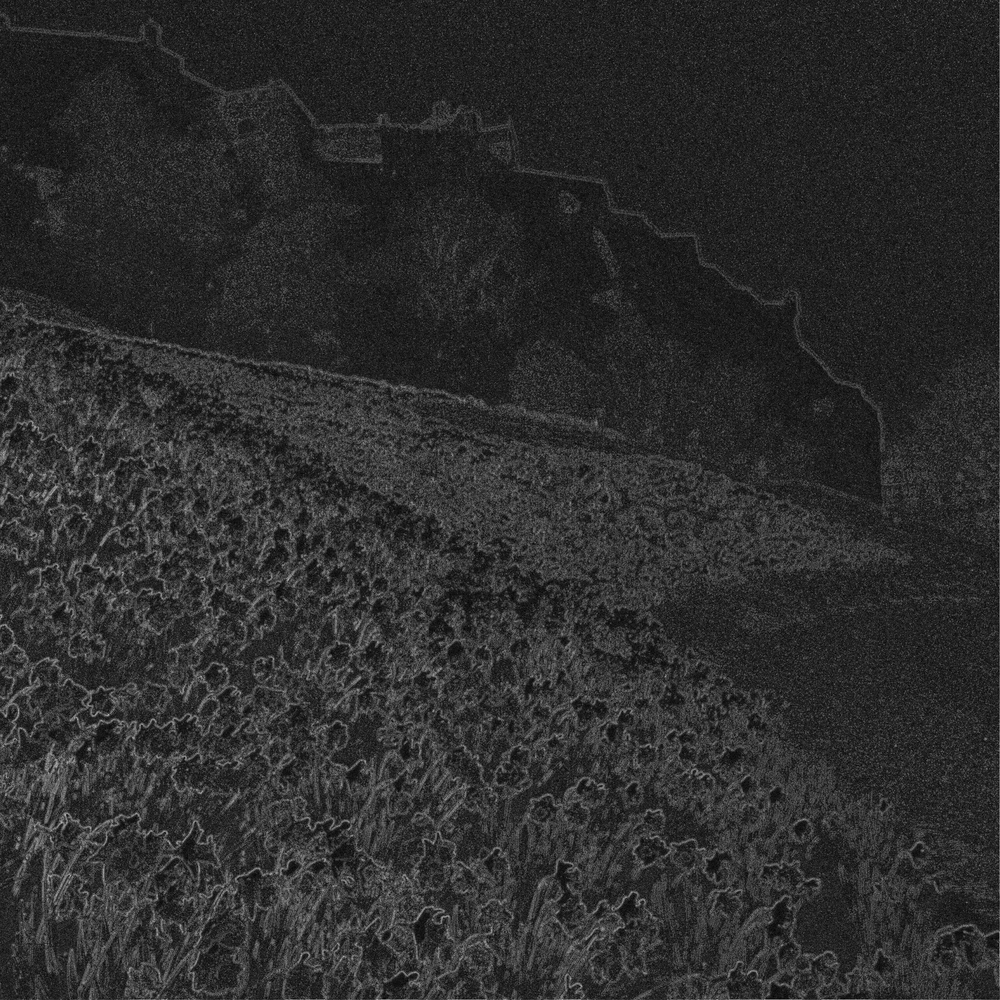
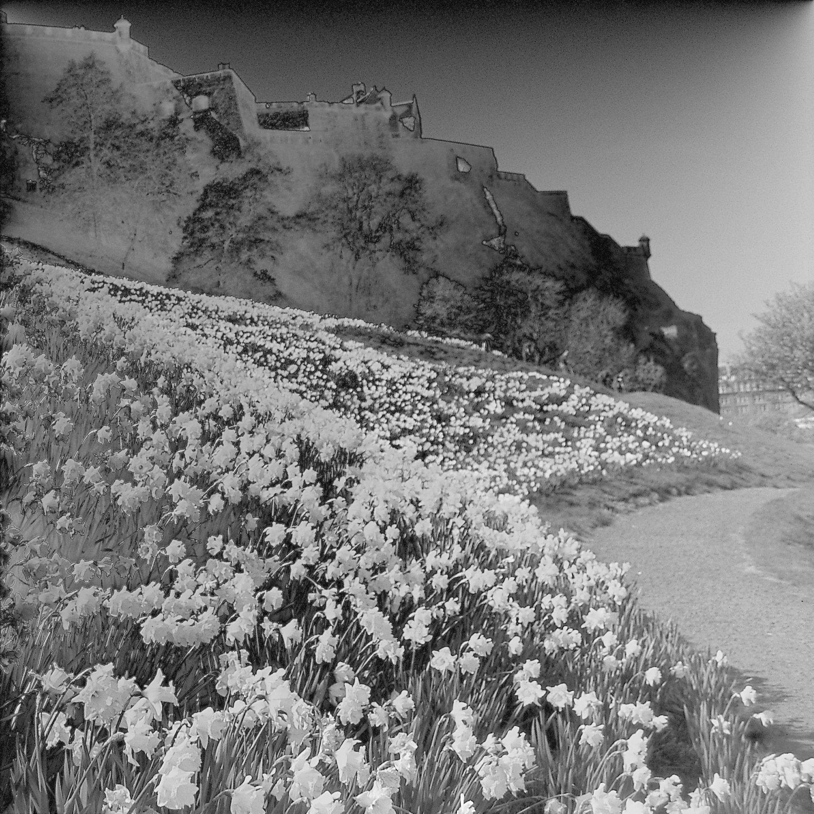

% Optimizing a CUDA application
% Rupert Nash, Kevin Stratford, Alan Gray

# Introduction

## Credits

Exercise content created by EPCC, The University of
Edinburgh. Documentation and source code copyright The University of
Edinburgh 2019. Lab style and template created by NVIDIA, see
<https://nvidia.qwiklab.com/>.

## Purpose

In this self-paced, hands-on lab, we will take an existing CUDA
application and go through several optimization steps, measuring the
performance benefits of each. We will see the importance of minimizing
data transfer, enabling coalesced memory access, and tuning the
parallel decomposition.

## Getting the source

As before the code can be cloned from GitHub:
```sh
git clone https://github.com/EPCCed/APT-CUDA.git
cd APT-CUDA/exercises/cuda-reconstruct
```

Or you can use your existing repo (update with `git pull`)

# Application

## Introduction

This exercise involves performing a series of optimizations to an
existing CUDA application.

---

You start with an image that looks like this:

{ width=50% }

---

Which has been generated from the original:

{ width=50% }

---

First is an image of Edinburgh Castle, processed such that the edges
between light and dark areas replace the original picture.

## Your job: reconstruct the initial image

This is an artificial thing to do, but it mimics many scientific
applications (e.g. that solve systems of PDEs) since the algorithm is
iterative, requiring many successive _stencil_ operations.

---

Each pixel of the new image $M$ is generated based on its neighboring
pixel values and the original edge data $E$ by repeatedly performing
the following update:

$$
M_{i,j} = \frac{M_{i-1,j} + M_{i+1,j} + M_{i,j-1} + M_{i,j+1} - E_{i,j}}{4}
$$

The more iterations, the better the reconstruction (although for
simplicity we work in greyscale rather than colour).

# Getting started
## Run the original

You are provided with a working but slow CUDA implementation of the
reconstruction algorithm.

First of all, let's compile and run the code. The code is set up to
run the algorithm on both the GPU and the CPU. It compares the outputs
from the two runs to verify correctness, and then displays timings for
each run.

## Build with make
Choose to work with either C or Fortran

C:
```sh
cd src_c
module load nvidia/nvhpc/22.11
make
```
Fortran:
```sh
cd src_fortran
module load nvidia/nvhpc/22.11
make
```

## Run on the batch system

To run, you need to know your budget code. To do this, you need to
know your budget code - you can check by logging into SAFEm navigating
to the relevant Cirrus login account and checking which budgets it can
access.

Submit the job with:
```
sbatch --account <YOUR BUDGET CODE> submit.sh
```

Query SLURM for your jobs:
```sh
squeue -u $USER
```

## View the resulting image

On Cirrus you can either:

1. View directly with `display` if you have set up
   X11 forwarding when you connected

```sh
module load ImageMagick
display output.pgm
```

2. Use `convert` to turn the output file
into e.g. a jpg or png file and then copy it to your client

```sh
module load ImageMagick
convert output.pgm output.jpg
```

---

Hopefully you can see that the picture is starting to become
clearer. As the algorithm is iterative, there is a loop in the main
routine that invokes the kernel $N=100$ times.

Increasing N will increase the quality of the reconstruction, but
please don't do this during the lab!

---

If you were to run for 10 million iterations, the resulting image
would look like this:

{ width=50% }

# Optimising

## Important note!

Keep a note of the run times of your jobs and what you have changed
each time!

## 
Now it's time to optimise the code and improve on the GPU timing
printed when you ran the code, by editing the source code.

Note that a one pixel wide _halo_ region of zeroes is added to each
edge of the various image-data arrays; this simplifies the computation
as it allows the edge pixels to be treated in the same manner as other
pixels.

Note: The edge array, which holds the original edge data, does not
have require a halo.


## Profiling

You can (should?) profile your code as you optimise it. There are
basic submission scripts for both Nsight Systems (`profile-nsys.sh`)
and Compute (`profile-ncomp.sh`) included. Once you have run these,
you can transfer the files to your workstation and analyse them with
the GUIs (available from NVIDIA
https://developer.nvidia.com/tools-overview).


## Minimizing Data Transfer 

A challenge with GPUs and other accelerators is that transferring data
between host memory and device memory is often relatively slow.  An
important optimization technique involves minimise the amount of data
that is transferred between host and device.

---

Notice that in the main loop in `reconstruct.cu` (C) or
`reconstruct.cuf` (Fortran), the data is copied from GPU
memory to host memory and then back to GPU memory at each
iteration. This is not in fact necessary; with the exception of the
final iteration when the data must be copied back to the host, it is
going to be processed on the GPU again in the next
iteration. Therefore, we can optimise manipulating the GPU memory
directly without expensive transfers.

---

We can simply copy the output array directly to the input array after
each iteration.

In order to do this you will need to:

## C

- Remove the `cudaMemcpy` calls from inside the main loop

- Replace them with a `cudaMemcpy` call to copy, directly on the
  device, from `d_output` to `d_input`
  
- Add a new `cudaMemcpy` call after the end of the loop (in between
  the two calls to `get_current_time()`) to copy the final result back
  from the GPU to the `output` buffer in host memory.

## Fortran

- Remove the assignments to `output` (from `d_output`) and to
  `d_input` (from `output`), inside the main loop

- Replace them with an assignment directly from `d_output` to
  `d_input`

- Add a new assignment after the end of the loop (in between the two
  calls to `cpu_time()`) to copy the final result back from the GPU to
  the `output` buffer in host memory

---

Once you have made these changes, compile and run the code again as
above and take note of the time taken by the GPU version.

How does it compare to the previous timing?


# Enabling Coalesced Memory Accesses

## Reminder

The GPU performs best when consecutive CUDA threads access consecutive
memory locations, allowing memory _coalescing_.

## C

For the kernel in `reconstruct_kernels.cu`, it can be seen that
consecutive threads correspond to consecutive rows of the image, but
consecutive memory locations instead correspond to consecutive
columns. The threads are not reading from consecutive locations.

## Fortran

For the kernel in `reconstruct_kernels.cuf`, it can be seen that
consecutive threads correspond to consecutive columns of the image,
but consecutive memory locations instead correspond to consecutive
rows. The threads are not reading from consecutive locations.

## What to do

* Update the kernel such that the role of the image row and column is
  reversed, in relation to how pixels are assigned to CUDA threads.

* Since the image is perfectly square, you will not need to change the
  way the kernel is launched.

* How does the performance compare to the previous version?

# Improving Occupancy

You should hopefully have seen a noticeable improvement in performance
as a result of the changes you made to reduce data transfers between
the host and the device and to enable coalescing. However, the current
solution is still sub-optimal as it will not create sufficient threads
to utilise all the SMs on the GPU - it has low _occupancy_.

---

GPU codes typically run best when there are many threads running in
parallel, each doing a small part of the work. We can achieve this
with our image processing code by using a thread for each pixel of the
image, rather than for each row or column as before. CUDA supports 1-,
2- or 3-dimensional decompositions. A 2D decomposition maps most
naturally onto the pixels of an image.

---

* Update your both your kernel, and the code responsible for
  specifying the decomposition such that that a 2D decomposition is
  over both rows and columns.

* The original code uses 256 threads per block in a 1D CUDA
  decomposition. Replace this with 16 threads in each of the X and Y
  directions of the 2D CUDA decomposition, to give a total of 256
  threads per block. Ensure that the number of blocks is specified
  appropriately in each direction.

* Ensure that you retain memory coalescing!

Measure performance and compare to the previous versions.

# Investigating Grid and Block Sizes

---

Once you have the 2D kernel working correctly, you can try altering
certain parameters and see what effect this has on its performance. In
particular, you can investigate the effects of different grid and
block sizes.

How does changing the grid and block sizes affect the total runtime?


